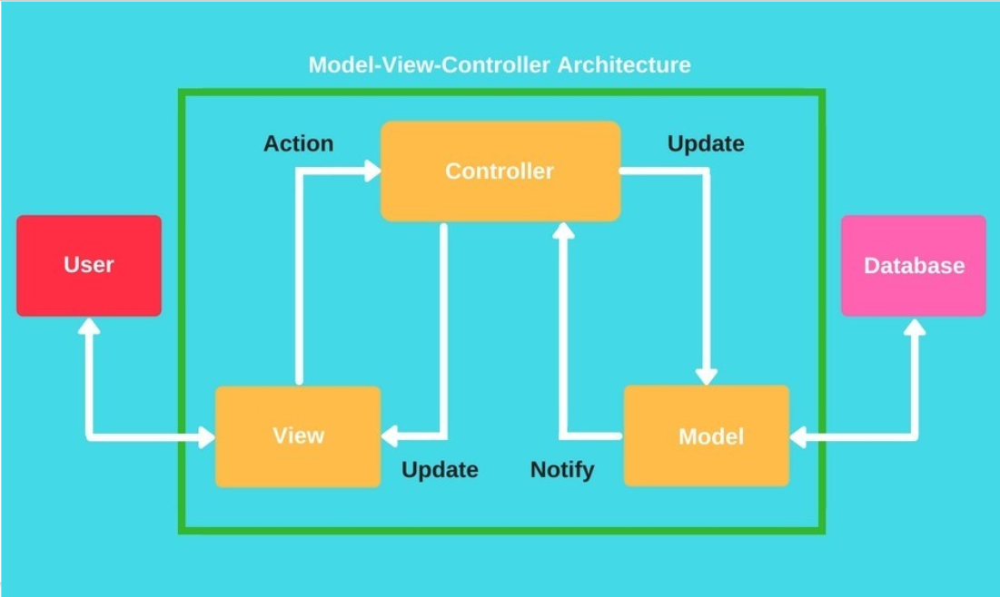

# FashionFeed and Squad Rooms

Reducing the barriers and differences between online and offline shopping, making it an ultimate collaborative and  immersive shopping experience for Users. 
EJS (Embedded Javascript) has been to generate the HTML Markup with plain javascript, for the Fashion Feed.
We generated REST APIs with Express and then used these endpoints in the frontend to interact with our backend part.

## HackerRamp feed 
Snap your latest fashion finds and post yout recent shopping experiences complemented with a non-stop diet of the latest looks and trends with a friend list to share. We have authenticated users in the application by storing the password of the users in the database since, it is never recommended to store plain text passwords as they can be compromised easily. So, bcrypt library has been utilised to hash the passwords before they are saved.

## Theme based Events
Shop and snap for a cause! For the backend side, Express library has been used on top of Nodejs. MongoDB has been used as the NoSQL database to store data as documents in JSON format and  employed mongoose to connect to MongoDB database.

## Solution Deep Dive
We have used the MVC (The Model View Controller) architectural pattern which separates concerns into one of 3 buckets so that we can work better as a team. Making independent models and views makes code organization simple and easy to understand and keeps maintenance easier.

## Theme based Squad Room
Shop with your squad! No worries of staying miles away. Shop for an urgent event with style.

## Squad Helpbot 
Stay updated with latest trends, discounts and offers! In the modern digital age, users look forward to more personalized and intuitive experiences. Improved our interactive containment rate with the latest BERT-based natural language understanding (NLU) models that are capable of recognizing intent and context accurately and efficiently in more complex use cases.

## Gallery - A collection from events 
Find all your memories at one place!! The images are fetched by the embedded javascript file from the object event in our mongodb database. 

## Squad - Cart 
Shop for your friends and take their feedback!! The is to enable users to take advantage of a discount, or just to cut down on shipping costs  like in offline shopping as it's super easy and intuitive to share your shopping experience with your friends or family, and moreover, to save money. 

## Next Phase
Excited to make the room's privacy editable and increase the collaborative experience, extending it beyond the comforts of offline shopping!
Next in the rooms we'll have self designing feature so that members can express what they have in mind to shop!
We still have a LOT to work on this prototype, we are excited to enable other features in the room and feed, improve the UI and make it more user friendly to make this even more meaningful and innovative. 

